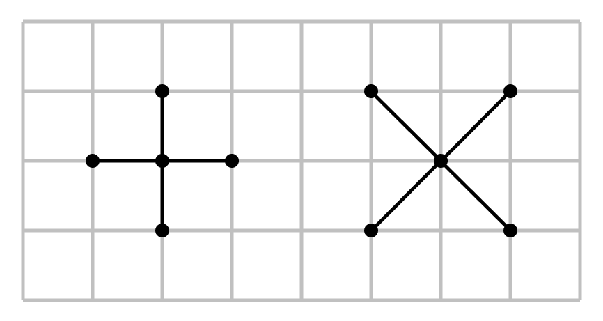

# Introduction
A toy project based on a global search framework I've concocted. Conceptually, the idea is to perform a low-resolution scan of an energy landscape to determine where the critical points are located. The scan starts with a stitch boundary, which is a set of vertices and edges (equivalently, vectors) with inwards orientation. The vectors (known as sutures) are then used to calculate the gradients of the landscape at the points and in the directions of the individual sutures. Based on the values of the initial boundary subsequent regions, internal to the first boundary, are chosen to narrow the search for critical points. This process is repeated until termination conditions are met. The collective gradients are used to create a low-resolution representation of the landscape. Once the low-resolution representation is created, further searching can occur with high-resolution algorithms (such as simulated annealing, genetic algorithms, SGD, etc...) to find an optimal result.

Presently, there are two main variants of a stitch boundary: The $+$ variant and the $\times$ variant.

 

# Stitch Boundaries
In formaly writing, the two variants take on the notation from before. In code, the $+$ variant stitch boundary takes on the notation PStitchBoundary. Similarly, the $\times$ variant stitch boundary takes on the notation XStitchBoundary.

## PStitchBoundary
A $+$ varient stitch boundary is the set:
$+(x_0, y_0, \Delta{x}, \Delta{y}) = \{\}$

Where $x_0$ and $y_0$ are the inital points for $x$ and $y$, respectively. $\Delta{x}$ and $\Delta{y}$ are the width and height of the boundary, respectively.

Visually, a $+$ variant expands in the following way:

## XStitchBoundary
An $\times$ varient stitch boundary is the set:
$\times(x_0, y_0, \Delta{x}, \Delta{y}) = \{\}$

Where $x_0$ and $y_0$ are the inital points for $x$ and $y$, respectively. $\Delta{x}$ and $\Delta{y}$ are the width and height of the boundary, respectively.

Visually, an $\times$ variant expands in the following way:

<!-- 

 -->